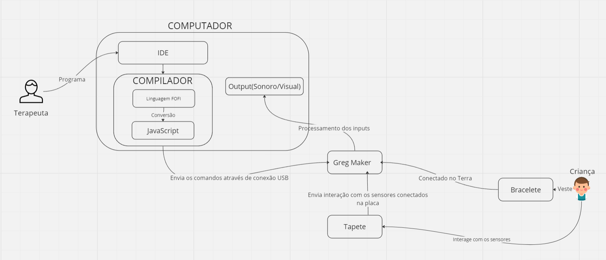

# Arquitetura do sistema

A arquitetura de um sistema é um plano detalhado que define a estrutura e o funcionamento de uma aplicação tecnológica. Ela descreve os componentes de software, hardware, suas relações e interações. Uma arquitetura de sistema bem elaborada é fundamental para a comunicação clara do projeto com o cliente. Ela serve como um mapa visual e conceitual que o ajuda a entender como diferentes componentes do sistema interagem e funcionam juntos para alcançar os objetivos desejados. Além disso, uma arquitetura clara permite que o cliente visualize a estrutura do projeto, facilitando discussões sobre modificações, priorizações e a tomada de decisões estratégicas sobre o desenvolvimento do produto.

## Funções dos Dispositivos no Sistema

### Dispositivos Computacionais
- **Computador**: O software será executado pelo computador como ferramenta para o processo de terapia, ele processa os dados dos sensores do tapete e do bracelete através do Greg Maker, e gera um output visual ou sonoro para o paciente.
- **Greg Maker**: Uma placa condutiva que traduz interações com objetos simples do cotidiano em comandos para o computador. Esta placa funciona como uma interface que permite à criança interagir com o computador de maneira inovadora e acessível, usando materiais do dia a dia para controlar e interagir com o software de terapia.

### Dispositivos de Entrada
- **Tapete**: Um dispositivo de entrada utilizado pela criança durante as atividades terapêuticas, capaz de detectar a interação e enviar esses dados ao computador através do Greg Maker que, por meio de conexão USB, transforma esses interações em entradas de teclado e mouse no computador.
- **Bracelete**: Vestido pela criança, interage com os sensores para enviar informações de comando ao Greg Maker e, subsequentemente, ao computador.

### Dispositivos de Saída
- **Computador(Output Sonoro/Visual)**: Dispositivos de saída que fornecem feedback auditivo e visual respectivamente, baseados nas interações da criança, com o bracelete, no tapete.

## Componentes de Software
- **IDE (Ambiente de Desenvolvimento Integrado)**: Software que permite ao terapeuta desenvolver através de programação em blocos as configurações das atividades no tapete.
- **Compilador**: Especificamente desenvolvido pelo grupo para traduzir os programas da linguagem FOFI para JavaScript (linguagem processada pelo Greg Maker), que então é executado através do hardware.

## Processo de Funcionamento do Sistema

O processo de funcionamento do sistema é integrado e sequencial, envolvendo a interação entre dispositivos e softwares para proporcionar uma experiência terapêutica interativa para a criança. Abaixo estão as etapas desse processo:

1. **Configuração Inicial pelo Terapeuta**: 
   - O terapeuta utiliza a **IDE** no computador para criar e programar as atividades terapêuticas utilizando a linguagem FOFI. 
   - As atividades são desenhadas para serem interativas e engajadoras, adequando-se às necessidades específicas de cada paciente.

2. **Compilação do Programa**:
   - Uma vez que o programa é desenvolvido na linguagem FOFI, o **compilador** converte este programa em JavaScript, preparando-o para ser executado no computador.

3. **Execução e Interatividade**:
   - Com o programa compilado e executando, a criança interage com o **tapete** utilizando o **bracelete**, que captam as interações através dos sensores no tapete e enviam esses dados ao Greg Maker.
   - O **Greg Maker**, interpreta esses sinais e os converte em comandos compreensíveis pelo computador.

4. **Feedback ao Usuário**:
   - O computador, agora recebendo os comandos do Greg Maker, gera outputs sonoros e visuais.
   - Esse feedback é essencial para o engajamento da criança na atividade terapêutica e para fornecer recompensas instantâneas baseadas na sua performance e interação com o sistema.

Este fluxo contínuo entre o terapeuta, a criança, o software e os dispositivos de hardware permite a criação de um ambiente terapêutico adaptativo e reativo que pode ser ajustado em tempo real para atender às necessidades do paciente.

